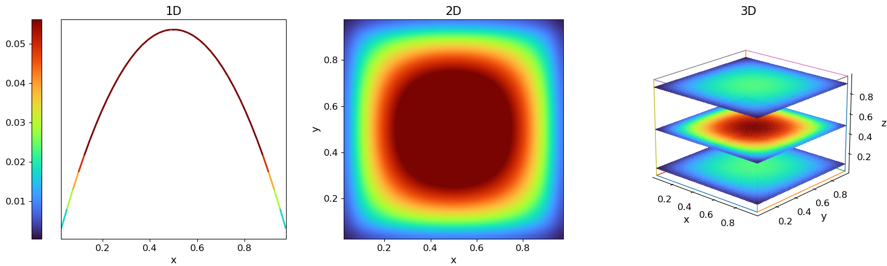

# Domain Decompostion Project

## Introduction

This repository contains the final **Domain Decomposition** project developed for the **AMSC course (2025–26)**. The project investigates how the solution of large **sparse linear systems**—typically produced by finite-difference discretizations of **elliptic PDEs**—can be accelerated and scaled across multiple processors using **algebraic domain decomposition** techniques.
$$\begin{cases}
-\mu\,\Delta u(\mathbf{x}) + c\,u(\mathbf{x}) = f(\mathbf{x}), & \mathbf{x}\in\Omega \\ u(\mathbf{x}) = g(\mathbf{x}), & \mathbf{x}\in\partial\Omega,
\end{cases}$$



The core benchmark is a **diffusion–reaction** model problem posed in dimension (d \in {1,2,3}). After discretization on structured grids, the resulting SPD system (A x = b) is solved with **Conjugate Gradient (CG)** and **Preconditioned CG (PCG)**. The focus is on understanding how the solver’s behavior changes when moving from a baseline (no preconditioning) to increasingly effective preconditioners—especially **Schwarz-type methods**, which naturally expose parallelism by splitting the global problem into overlapping subproblems.

In particular, the project provides and compares:

* **Baseline CG / PCG with Identity preconditioner** ((M = I)), used as a reference to highlight the impact of mesh refinement on conditioning and iteration counts.
* **Classical preconditioners** such as Jacobi-type variants (when enabled), used as lightweight baselines.
* **Additive Schwarz domain decomposition** preconditioning (one-level and/or two-level/coarse-enhanced depending on configuration), designed to reduce the condition number through local subdomain solves and optional global correction.

Performance is evaluated end-to-end using:

* **Iteration counts** and convergence behavior,
* **Setup / solve / total time** breakdown,
* **Time-per-iteration** and scalability trends under different numbers of subdomains/processes.

The repository also includes ready-to-run benchmark scripts that reproduce the experimental campaign and generate logs suitable for plotting and report inclusion.


## Structure of the Projects

```
.
├── benches
│   ├── ... all the benches to tests performance and accuracy

├── CMakeLists.txt
├── data

├── docs

├── include
│   ├── ... includes all the headers .hpp

├── run 
├── src
│   ├── algebra
│   ├── COO.cpp
│   ├── CSR.cpp
│   ├── matrixDense.cpp
│   └── matrixSparse.cpp
├── partitioner
│   └── partitioner.cpp
├── pde
│   └── pde.cpp
├── preconditioner
│   ├── additive_schwarz.cpp
│   ├── block_jacobi.cpp
│   ├── diagonal_jacobi.cpp
│   ├── identity.cpp
│   └── preconditioner.cpp
└── solver
    ├── pcg.cpp
    ├── pcg_mpi.cpp
    └── solver.cpp
├── tests
    ├──  ... all unit/integration tests to verify correctness
└── tools
```


## Requirements

To compile and run the project you need a standard C++ toolchain and CMake.  
Some executables use MPI (e.g., `pcg_mpi`, MPI-aware Additive Schwarz), so MPI is required to build/run those targets.

### Mandatory
- **CMake** (recommended: `>= 3.16`)
- **C++ compiler** with **C++17 or newer** support  
  (e.g., GCC / Clang)
- **Git** (only to clone the repository)

### Required for MPI benchmarks / MPI executables
- **MPI implementation** providing `mpicxx` and `mpi.h`  
  - OpenMPI or MPICH are both fine

### Notes
- If MPI is not installed, only **serial-only** targets (if provided) can be built/run.
- On Windows, the recommended setup is **WSL2 (Ubuntu)** with GCC + CMake (+ MPI if needed).

## Compile and run

### Build (CMake)
From the repository root:
```bash
mkdir -p build
cd build
cmake .. -DCMAKE_BUILD_TYPE=Release
make -j
ctest 
````

**Configuration options (as reported by CMake):**

* `DD_BUILD_TESTS=ON` (unit tests enabled)
* `DD_BUILD_BENCHES=ON` (benchmarks enabled)
* `DD_ENABLE_MPI=ON` (MPI-enabled targets enabled)
* `DD_ENABLE_SANITIZERS=OFF`
* `BUILD_SHARED_LIBS=OFF`

This generates the core static library (`libdd_algebra.a`) and the project executables in `build/`, including:

* Tests: `testMatrixDense`, `testMatrixSparse`, `testSolver`, `testPreconditioner`, `testPartitioner`, `testMPI`, `testPDE`
* Benches: `bench_pcg_sequential`, `bench_seq_as_blocks`, `bench_mpi_as_coarse`, `physical_problem`,
  `bench_baseline_identity_solver`, `bench_final_identity_vs_AS2`

### Run benchmarks (recommended)

After building, go back to the repository root and execute the provided runner script:

```bash
cd ..
./run/all-run.sh
```

This script launches the full benchmark suite:

* `baseline-identity.sh`
* `compare-different-subs.sh`
* `mpi-as-coarse-tests.sh`
* `strong-scalability.sh`
* `final-bench-run.sh`

Each run produces a timestamped log in:

```
run/logs/
```

If all scripts succeed, the runner prints a final summary with `Total failed scripts: 0`.

You can also find results of perfomance and correctness in `.csv`
```
cd data/output/csv
```
# Report 
You can find the report of the project `report.pdf`
```
cd docs
```